# LP Climb

[](https://github.com/Skpow1234/LP-climb/actions/workflows/ci.yml)
[](https://github.com/Skpow1234/LP-climb/releases/latest)
[](./LICENSE)


League-inspired **Ranked Climb Ladder** animation powered by **GitHub contribution data**.

<picture>
  <source media="(prefers-color-scheme: dark)" srcset="docs/theme-previews/assassin.svg" />
  <source media="(prefers-color-scheme: light)" srcset="docs/theme-previews/rift.svg" />
  
</picture>

## Live demo

- **GitHub Pages**: `https://skpow1234.github.io/LP-climb/`

## Ways to use LP Climb

- **GitHub Action**: generate `dist/*.svg` in a workflow (recommended for profile READMEs).
- **Nightly “output branch” publishing**: auto-push generated SVGs to an `output` branch (for `raw.githubusercontent.com/...` embeds).
- **Hosted API**: request `/v1/render.svg` on-demand (great for apps + dashboards).
- **GitHub Pages demo**: a static UI where users type a username/theme and preview the ladder (calls your hosted API).
- **Docker**: run the API locally, or run the action image as a container.

## Recipes (copy/paste)

### 1) Profile README (recommended)

Use the action to generate to `dist/`, then push `dist/` to `output` (via `nightly.yml`).

**Outputs**:

```text
dist/lp.svg?theme=rift
dist/lp-dark.svg?theme=assassin
```

**Embed**:

```html
<picture>
  <source media="(prefers-color-scheme: dark)" srcset="https://raw.githubusercontent.com/<OWNER>/<REPO>/output/lp-dark.svg" />
  <source media="(prefers-color-scheme: light)" srcset="https://raw.githubusercontent.com/<OWNER>/<REPO>/output/lp.svg" />
  /<REPO>/output/lp.svg" />
</picture>
```

### 2) On-demand (apps / dashboards)

```text
https://<API_HOST>/v1/render.svg?user=octocat&theme=rift&width=900&height=260
```

Raster formats (use `quality` to tune size vs. fidelity):

```text
https://<API_HOST>/v1/render.png?user=octocat&theme=rift
https://<API_HOST>/v1/render.webp?user=octocat&theme=rift&quality=85
https://<API_HOST>/v1/render.avif?user=octocat&theme=rift&quality=55
```

Animated GIF (CPU-heavy; cache it):

```text
https://<API_HOST>/v1/render.gif?user=octocat&theme=rift&frames=24&fps=12
```

### 3) 1v1 ladder (VS)

```text
https://<API_HOST>/v1/render.svg?user=octocat&vs=torvalds&theme=rift
```

### 4) Named size preset

Skip fiddling with `width`/`height` — pass a preset (list at `/v1/presets.json`):

```text
https://<API_HOST>/v1/render.svg?user=octocat&theme=rift&preset=banner
```

Explicit `width` / `height` always override the preset's values.

## API endpoints (hosted render service)

- `GET /v1/render.svg?user=USER&theme=rift` (**recommended**)
  - Legacy alias: `GET /render.svg?...` (deprecated)
  - Optional: `&vs=OTHER_USER` for 1v1 comparison
  - Optional: `&width=900&height=260` or `&preset=<id>` (see `/v1/presets.json`)
- `GET /v1/render.png?user=USER&theme=rift`
  - Legacy alias: `GET /render.png?...` (deprecated)
- `GET /v1/render.webp?user=USER&theme=rift&quality=82` (smaller than PNG)
- `GET /v1/render.avif?user=USER&theme=rift&quality=55` (smallest; slower encode)
- `GET /v1/render.gif?user=USER&theme=rift&frames=24&fps=12` (animated; CPU-heavy)
- `GET /v1/meta.json?user=USER` (**recommended**)
  - Legacy alias: `GET /meta.json?...` (deprecated)
  - Optional: `&vs=OTHER_USER`
- `GET /v1/github-contrib/:user` — normalized `{ x, y, date, count, level }` cells for clients that can't call GitHub GraphQL directly (shares the SWR cache with render endpoints; no token ever leaves the server)
- `GET /v1/themes.json` (theme catalog)
- `GET /v1/presets.json` (dimension preset catalog)
- `GET /v1/metrics` — Prometheus text exposition (alias: `GET /metrics`)
- `GET /v1/healthz` (**recommended**)
  - Legacy alias: `GET /healthz`

All render endpoints share the same theme/override/`preset` query params and the same SWR LRU cache (responses include `Cache-Control` and `X-Cache: miss|hit|stale`).

## GitHub Action (generate SVGs in workflows)

### Use the action

In this repo (local workflow testing):

- `uses: ./`

Published usage (after you release tags):

- `uses: Skpow1234/LP-climb@vX.Y.Z`

Example:

```yaml
- uses: Skpow1234/LP-climb@v0.1.0
  with:
    github_user_name: ${{ github.repository_owner }}
    outputs: |
      dist/lp.svg?theme=rift
      dist/lp-dark.svg?theme=assassin
      dist/lp-vs.svg?theme=rift&vs=torvalds
```

### Publish to an `output` branch (snk-style)

This is the simplest way to embed SVGs into a profile README: generate to `dist/`, then push `dist/` to an `output` branch.

- Use `.github/workflows/nightly.yml` (already included in this repo).
- Result files end up at:
  - `https://raw.githubusercontent.com/<OWNER>/<REPO>/output/lp.svg`
  - `https://raw.githubusercontent.com/<OWNER>/<REPO>/output/lp-dark.svg`

Embed example (dark/light):

```html
<picture>
  <source media="(prefers-color-scheme: dark)" srcset="https://raw.githubusercontent.com/<OWNER>/<REPO>/output/lp-dark.svg" />
  <source media="(prefers-color-scheme: light)" srcset="https://raw.githubusercontent.com/<OWNER>/<REPO>/output/lp.svg" />
  /<REPO>/output/lp.svg" />
</picture>
```

## GitHub Pages demo (static UI)

This repo includes a static demo site that can be deployed to **GitHub Pages**. The demo site **does not** call GitHub directly; it calls your hosted LP Climb API.

### Deploy

1) Enable Pages: **Repo Settings → Pages → Source: GitHub Actions**
2) Set an Actions variable:
   - **Name**: `LP_CLIMB_API_BASE`
   - **Value**: your hosted API base URL (example: `https://lp-climb-api.example.com`)
3) Push to `main` (or run workflow `pages` manually)

The workflow is: `.github/workflows/pages.yml`.

### Local build (static)

```bash
npm install --workspaces --include-workspace-root
npm --workspace packages/demo run build:pages
```

Outputs: `packages/demo/dist/`

## Hosted API

### Local (dev)

```bash
## Requires Bun installed (see https://bun.sh)
bun install
cp .env.example .env
bun run dev
```

### npm fallback (if you don't want Bun)

```bash
npm install --workspaces --include-workspace-root
cp .env.example .env
npm run dev:npm
```

Then open:

- `http://localhost:3000/v1/render.svg?user=octocat&theme=rift`
- `http://localhost:3000/v1/render.svg?user=octocat&vs=torvalds&theme=assassin`
- `http://localhost:3000/v1/render.gif?user=octocat&theme=rift&frames=18&fps=12`
- `http://localhost:3000/v1/presets.json`
- `http://localhost:3000/v1/github-contrib/octocat`

### Call the hosted API directly

Example URLs:

- `/v1/render.svg?user=octocat&theme=rift`
- `/v1/render.svg?user=octocat&theme=rift&vs=torvalds`
- `/v1/meta.json?user=octocat`

Tip: SVG is easiest to use via `` (no CORS needed). For `fetch()` from browser clients (e.g. `meta.json`, `themes.json`, `presets.json`, `github-contrib/:user`), **CORS is on by default** — the API registers `@fastify/cors` with `Access-Control-Allow-Origin: *`, `GET`/`HEAD`/`OPTIONS`, and exposes `X-Cache`, `X-Request-Id`, `Deprecation`, `Sunset`, `Link`, and the `RateLimit-*` headers. Lock it down to specific origins with `CORS_ALLOW_ORIGINS=https://a.example.com,https://b.example.com`, or disable it entirely by setting `CORS_ALLOW_ORIGINS=` (empty).

## Demo playground (local dev server)

Start the API first, then the demo dev server:

```bash
# terminal 1
bun run dev

# terminal 2
bun run demo
```

Demo UI:

- `http://localhost:5173`

## Docker

```bash
cp .env.example .env
docker compose up --build
```

### Publishing (prod)

To make pipelines “real” (pinned, reproducible), publish images to GHCR:

- Run workflow `publish-action-image` to push the action image.
  - It prints a pinned reference like:
    - `docker://ghcr.io/OWNER/REPO-action@sha256:...`
  - It also **commits the pin** back into `action.yml`.
- Run workflow `publish-api-image` to push the API service image.
- Or: push a git tag like `v0.1.0` to trigger the `release` workflow, which builds/pushes both images and creates a GitHub Release.

Then deploy the API image anywhere that can run a container (VM, Fly.io, Render, Railway, Kubernetes).

## Themes

`theme` supports:

- `rift` (default)
- `assassin`, `mage`, `tank`, `support`, `marksman`
- `mono`

### Theme catalog

List all themes + their colors:

- `GET /v1/themes.json`

### Recommended dark/light pairs

Pick any combination, but these pairs read well on GitHub:

| Light | Dark |
| --- | --- |
| `rift` | `assassin` |
| `support` | `mage` |
| `marksman` | `tank` |
| `mono` | `mono` |

### Custom theme params (optional)

You can override colors directly in the render URL (useful for personalization / “champion select”):

- **base colors**: `bg`, `frame`, `text`, `accent`, `glow`
- **tier colors**: `tier_iron`, `tier_bronze`, `tier_silver`, `tier_gold`, `tier_plat`, `tier_emerald`, `tier_diamond`, `tier_master`, `tier_grandmaster`, `tier_challenger`

Example:

```text
/v1/render.svg?user=octocat&theme=rift&accent=%23ff00aa&bg=%23000000&tier_challenger=%23ffd36b
```

## API compatibility

The `/v1/...` namespace is the canonical API. Breaking changes are introduced behind a new URL major (`/v2`, etc.) with at least a **90-day deprecation window**, during which the old route keeps responding and emits RFC 8594 `Deprecation`, `Sunset`, and `Link: ...; rel="successor-version"` headers. The legacy unversioned routes (`/render.svg`, `/render.png`, `/meta.json`) are already deprecated and will sunset on **2026-12-31**; `/healthz` is kept as a permanent alias so external probes don't break.

See [`docs/api-compatibility.md`](./docs/api-compatibility.md) for the full policy, the list of what counts as breaking vs. non-breaking, and the sunset calendar.

## Observability

- **Request IDs**: every response includes `X-Request-Id`; if your proxy / CDN already sets one, the API honors it. Every log line carries `reqId` plus `method`, `route`, `status`, and `durationMs`.
- **Metrics**: scrape `GET /metrics` (or `/v1/metrics`). Exposed series include default Node process metrics (`process_cpu_*`, `nodejs_heap_*`, etc.), `http_requests_total{method,route,status}`, `http_request_duration_seconds` histogram, `lp_climb_cache_events_total{kind,source}`, and `lp_climb_github_fetch_total{result}`.
- **OpenTelemetry** (zero-code opt-in): add `@opentelemetry/auto-instrumentations-node` to your runtime image and start the process with `NODE_OPTIONS="--require @opentelemetry/auto-instrumentations-node/register"`. The Fastify and HTTP auto-instrumentations will capture routes and propagate trace context from the `X-Request-Id` header.

## Troubleshooting

- **Demo/preview shows nothing**: open the generated SVG URL in a new tab. If you see JSON like `{ "error": "...", "message": "..." }`, the API is returning an error (rate limit / bad token / invalid username).
- **Render root shows 404**: use `/v1/healthz` (the API does not serve `/`).
- **SVG looks “transparent” on some backgrounds**: use a theme with an explicit `bg` (all built-in themes include `bg`) or pass `&bg=%23000000`.

### Theme previews

Run:

```bash
npm run theme-previews
```

Outputs are written to `docs/theme-previews/*.svg`.
